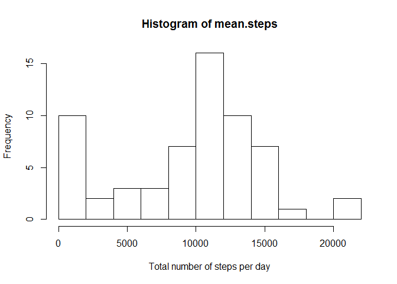
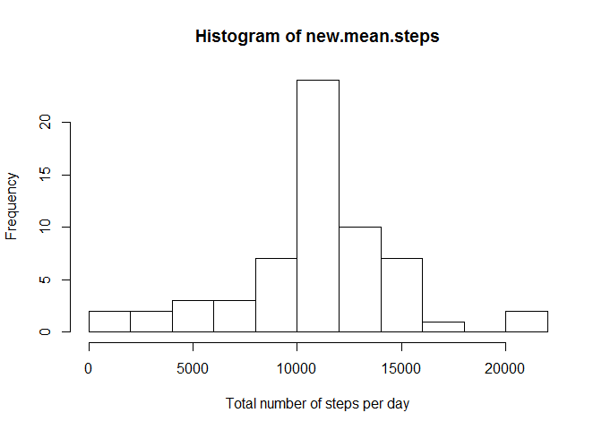
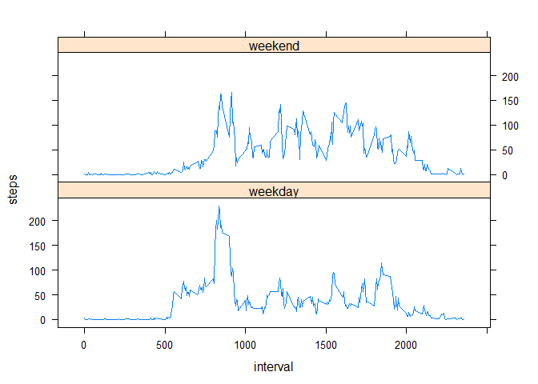

# Reproducible Research: Peer Assessment 1


## Loading and preprocessing the data

```r
#fileurl <- "https://d396qusza40orc.cloudfront.net/repdata%2Fdata%2Factivity.zip"
#download.file(fileurl, destfile="./repdata-data-activity.zip")
data <- read.csv(unz("repdata-data-activity.zip", "activity.csv"))
```

## What is mean total number of steps taken per day?

```r
mean.steps <- tapply(data$steps, data$date, FUN=sum, na.rm=T)

hist(mean.steps, breaks=10, xlab="Total number of steps per day")
```

 

```r
mean(mean.steps)
```

```
## [1] 9354.23
```

```r
median(mean.steps)
```

```
## [1] 10395
```

## What is the average daily activity pattern?

```r
meaninterval.steps <- aggregate(x=list(steps=data$steps), by=list(interval=data$interval), FUN=mean, na.rm=TRUE)
plot(meaninterval.steps, type="l")
```

 

```r
meaninterval.steps[which.max(meaninterval.steps$steps),]
```

```
##     interval    steps
## 104      835 206.1698
```

## Imputing missing values


```r
sum(is.na(data$steps))
```

```
## [1] 2304
```

```r
na.replace <- function(steps, interval) {
    replace <- NA
    if (!is.na(steps))
        replace <- c(steps)
    else
        replace <- (meaninterval.steps[meaninterval.steps$interval==interval, "steps"])
    return(replace)
}
newdata <- data
newdata$steps <- mapply(na.replace, newdata$steps, newdata$interval)

new.mean.steps <- tapply(newdata$steps, newdata$date, FUN=sum, na.rm=T)
hist(new.mean.steps, breaks=10, xlab="Total number of steps per day")
```

 

```r
mean(new.mean.steps)
```

```
## [1] 10766.19
```

```r
median(new.mean.steps)
```

```
## [1] 10766.19
```

## Are there differences in activity patterns between weekdays and weekends?


```r
day.type <- function(date){
  day <- weekdays(date)
  if(day %in% c("Saturday", "Sunday")) 
    return("weekend")
   else 
    return("weekday")
}

newdata$date <- as.Date(newdata$date)
newdata$day <- sapply(newdata$date, FUN=day.type)

mean.day.type <- aggregate(steps ~ interval + day, data=newdata, mean)

library(lattice)
xyplot(steps~interval | day, data = mean.day.type, layout=c(1,2), type="l")
```

 
